# Movement exercises

* **Exercise 1**:

The main purpose of this exercise is to become familiar with the use of the 
Inspector. In the code, this is achieved by adding the public attribute to our 
attributes in the script. Each public attibute could be modify through the 
Inspector.

On the other hand, the main idea behind the script is to initialize the vector 
containing the color components of the object with random values. Then, every 
certain number of frames (`Time.frameCount % framesToWait == 0`), one of the 
components is updated with a new random value. The number of frames to wait 
depends on the `framesToWait` attribute, which can be modified directly from 
the Inspector.

As a result, our cylinder changes color, and its frequency can be modified 
through the Inspector, as illustrated in the GIF.

* **Exercise 2**:

The main purpose of this exercise is to work with vectors in Unity and become 
familiar with some of the operations that can be performed on them. The script 
defines two `Vector3` variables, `firstVector` and `secondVector`, which can 
be modified directly from the Inspector.

For each frame, the script calculates several properties of both vectors. 
It calculates the angle between them using `Vector3.Angle()` and the distance 
between them using `Vector3.Distance()`.

The calculated values are stored in public variables, allowing them to be 
displayed in the Inspector. The same information is also printed to the Unity 
Console using `Debug.Log()`. This allows us to observe how the different 
properties change when the vectors are modified.

The resulting calculations can be observed in the Console when the vector 
components are change using the Inspector, as illustrated in the GIF.

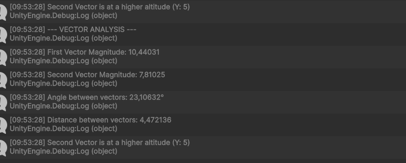

* **Exercise 3**:

The main purpose of this exercise is to learn how to access the position of a 
GameObject in two different ways. The script stores the sphere's position in a 
`Vector3` variable, which is displayed in the Inspector.

First, the script '3.1' directly accesses the `Transform` component through 
`transform.position` and stores the resulting position in the `spherePosition` 
variable. 

Then, the script '3.2' uses `GetComponent<Transform>()` to retrieve the 
GameObject's `Transform` component. If the component is found, its position 
is accessed through `transformComponent.position` and stored in 
`spherePosition`.

Therefore, the exercise demonstrates two different approaches to accessing a 
GameObject's position: directly through the `transform` property and by first 
retrieving the `Transform` component using `GetComponent<Transform>()`. The 
results are shown in the screenshot below, where the sphere's position can be 
seen in the Inspector.

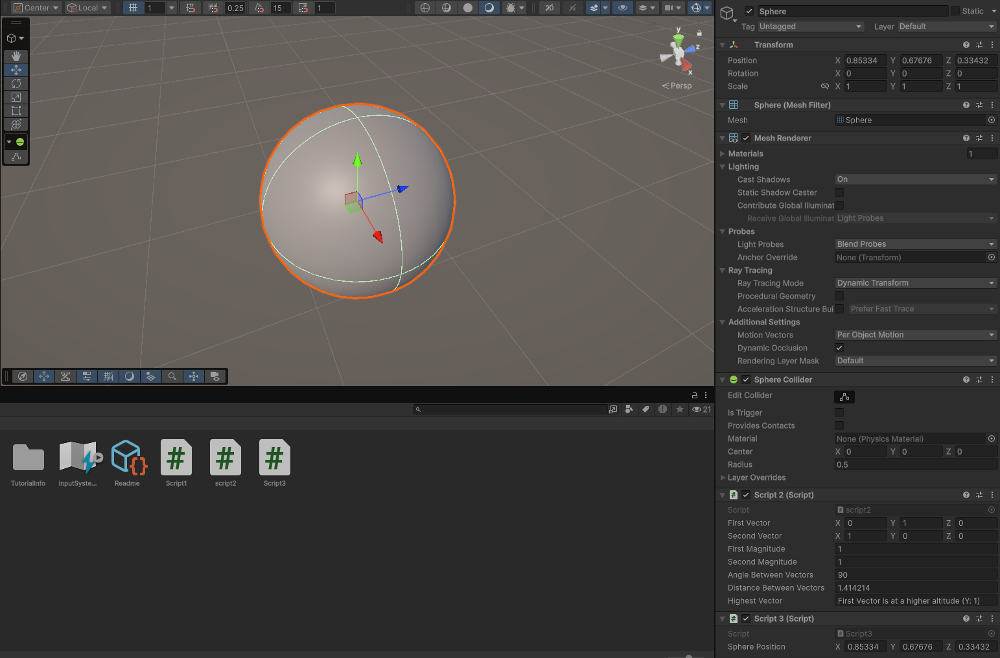

* **Exercise 4**:

The main purpose of this exercise is to learn how to find and interact with 
specific GameObjects using tags. To achieve this, it was necessary to create 
the `Cube` and `Cylinder` tags in the Inspector and assign them to their 
corresponding GameObjects.

At the beginning of the script, the `GameObject.FindWithTag()` method is used 
to find the objects associated with each tag. The references to the cube and 
cylinder are then stored in the `cubeObject` and `cylinderObject` variables. 

During each frame, the script calculates the distance between the current 
GameObject and both the cube and the cylinder using `Vector3.Distance()`. 
These distances are stored in the `distanceToCube` and `distanceToCylinder` 
variables.

As a result, we can observe in real time how the distances to the cube and 
cylinder change as their positions are modified.

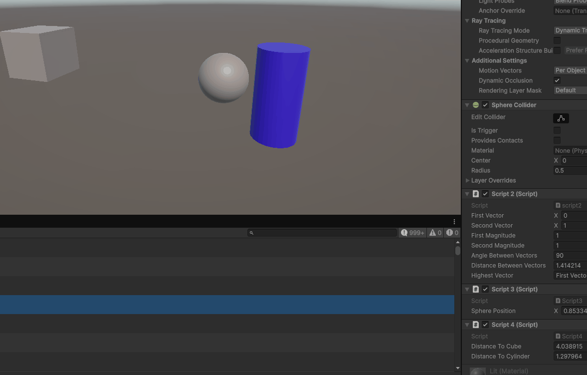

- **Exercise 5**:

The main purpose of this exercise is to learn how to relocate GameObjects to a 
new target position calculated using a displacement vector when a specific 
input action is triggered.

The script stores the object's initial location in the `originalPosition` 
variable during the `Start()` method. A public `Vector3` attribute named 
`displacement` allows setting custom $(x, y, z)$ offsets for each object 
directly through the Inspector.

During each frame, the script checks for input using `Input.GetAxis("Jump")`. 
When the spacebar is pressed (`jumpInput > 0f`), the `RelocateObject()` 
method updates the GameObject's `transform.position` by adding the 
`displacement` vector to its `originalPosition`. Additionally, a log message 
is sent to the Unity Console indicating the object's new coordinates.

As a result, each configured object instantly moves to its designated target 
position upon pressing the spacebar, as demonstrated in the scene.

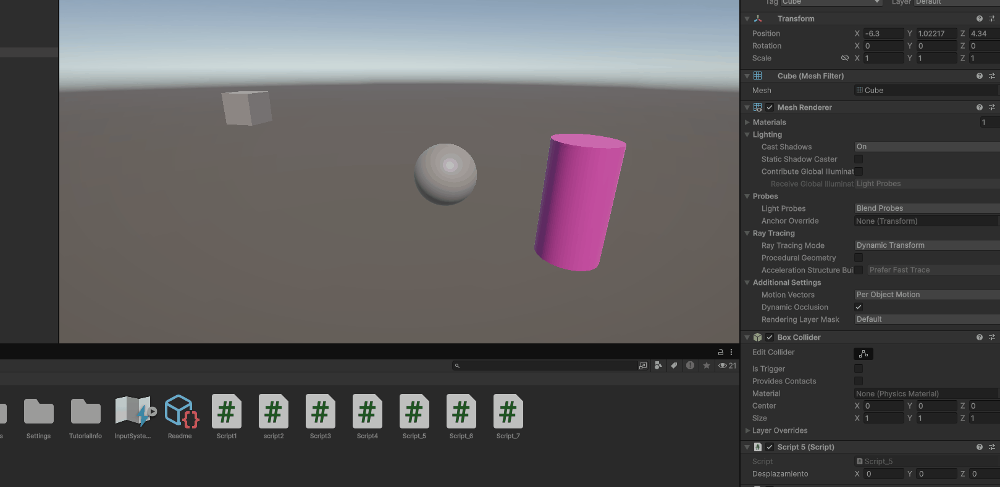

- **Exercise 6**:

The main purpose of this exercise is to combine virtual axis reading 
(`Input.GetAxis`) with specific key detection (`Input.GetKey` and `KeyCode`) 
to scale user input by a configurable speed value.

The script defines a public `speed` attribute, which can be modified directly 
in the Inspector. During every frame, the script retrieves the current values 
of the `Horizontal` and `Vertical` virtual axes. 

It then uses `Input.GetKey()` with `KeyCode` enum values (`UpArrow`, 
`DownArrow`, `RightArrow`, and `LeftArrow`) to detect when specific arrow keys 
are held down. When a key press is detected, the script multiplies the 
corresponding axis value by the `speed` attribute and logs the result to the 
Unity Console, starting the message with the name of the pressed arrow key.

As a result, pressing any arrow key outputs real time calculated movement 
values to the Console scaled by the cube's speed setting, as illustrated below.

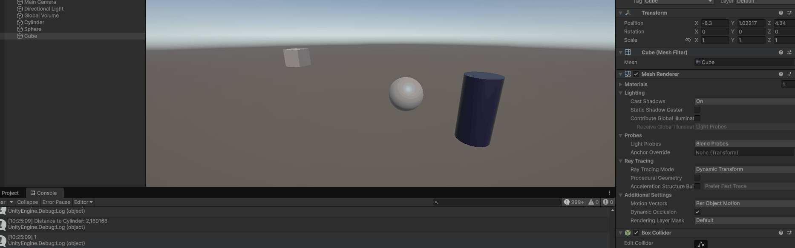

- **Exercise 7**:

The main purpose of this exercise is to learn how to reconfigure default input 
mappings in Unity's Input Manager so that virtual buttons trigger custom game 
actions.

In the Unity Editor settings (Edit → Project Settings → Input Manager), the 
`Fire1` virtual button was modified to bind the `h` key as an alternative or 
primary button. In the script, the `CheckFireInput()` method checks during 
each frame if the button is pressed using `Input.GetButtonDown("Fire1")`.

When the `h` key is pressed, the script calls the `Shoot()` method, which logs 
a firing message to the Unity Console. This demonstrates how code can remain 
decoupled from hardcoded physical keys by relying on Unity's virtual input 
names.

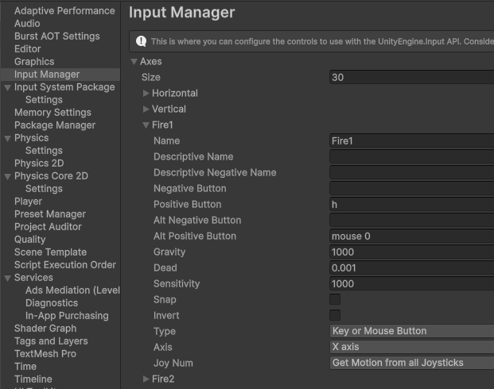

- **Exercise 8**:

The main purpose of this exercise is to understand transform-based movement 
using displacement vectors, configurable speed, and space reference systems.

The script defines a public `Vector3` attribute named `moveDirection` and a 
public `speed` attribute set to `2f`. During each frame, the `MoveCube()` 
method calculates a `displacement` vector by multiplying `moveDirection` by 
`speed` and `Time.deltaTime`, the cube is then translated.

The experimental observations for each requested scenario are detailed below:

1. *Doubling the coordinates of `moveDirection`*: Since `moveDirection` is not 
normalized in the code, doubling its components doubles the magnitude of the 
displacement vector, causing the cube to move twice as fast.

2. *Doubling `speed` while keeping `moveDirection` unchanged*: Doubling the 
scalar `speed` doubles the displacement magnitude, yielding the exact same 
quantitative speed increase as doubling the vector coordinates.

3. *Using a speed smaller than 1*: The displacement per second is reduced, 
causing the cube to move very slowly and smoothly.

4. *Initial position with Y > 0*: Since `moveDirection` has Y = 0, the cube 
moves horizontally in the air, maintaining a constant vertical elevation offset.

5. *Switching between local (`Space.Self`) and global (`Space.World`) reference 
spaces*: In `Space.Self`, rotating the cube alters its trajectory so that it 
moves relative to its own local axes. In `Space.World`, the cube moves strictly 
along the fixed global axes regardless of its orientation.

As a result, the cube translates according to its direction and speed settings, 
as illustrated in the GIF below.

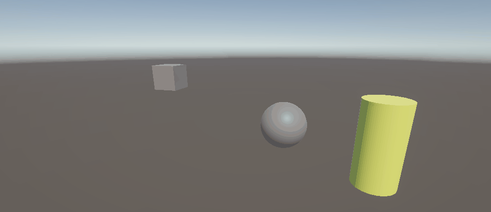

- **Exercise 9**:

The main purpose of this exercise is to implement frame-dependent movement for 
two different GameObjects using two distinct input handling strategies: virtual 
axes for the cube and explicit hardware key bindings for the sphere.

In the script '9.1' attached to the cube, the `MoveCube()` method retrieves 
input values from Unity's `Horizontal` and `Vertical` virtual axes using 
`Input.GetAxis()`. These inputs are multiplied directly by the public `speed` 
attribute to calculate frame displacement values along the X and Z axes, which 
are then applied using `transform.Translate()`.

In the script '9.2' attached to the sphere, the `MoveSphere()` method reads key 
presses directly using `Input.GetKey()` with `KeyCode` values (`W`, `S`, `A`, 
and `D`). It accumulates displacement values along the Z (forward/backward) and 
X (left/right) axes based on `speed` and translates the sphere accordingly.

As a result, both objects can be controlled independently across the 3D plane, 
as illustrated in the GIF below.

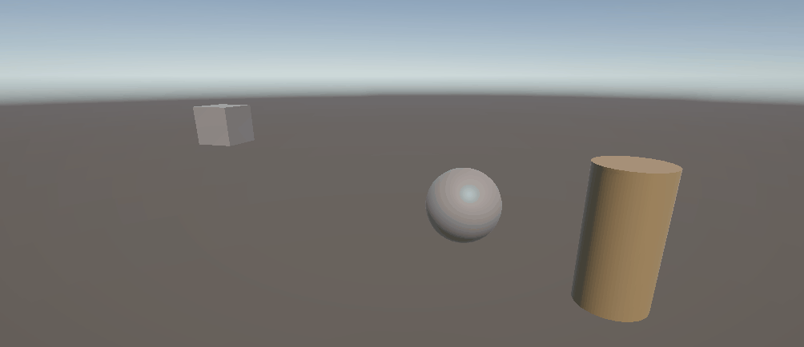

- **Exercise 10**:

The main purpose of this exercise is to adapt the controls from Exercise 9 to 
make the movement frame-rate independent by scaling displacement values with 
time.

Now the displacement calculations are multiplied by `Time.deltaTime`. This 
converts the `speed` attribute from units-per-frame into units-per-second, 
ensuring identical movement speed regardless of hardware performance or frame 
rate fluctuations.

As a result, both objects move smoothly across the plane at a consistent 
physical speed, as illustrated in the GIF below.

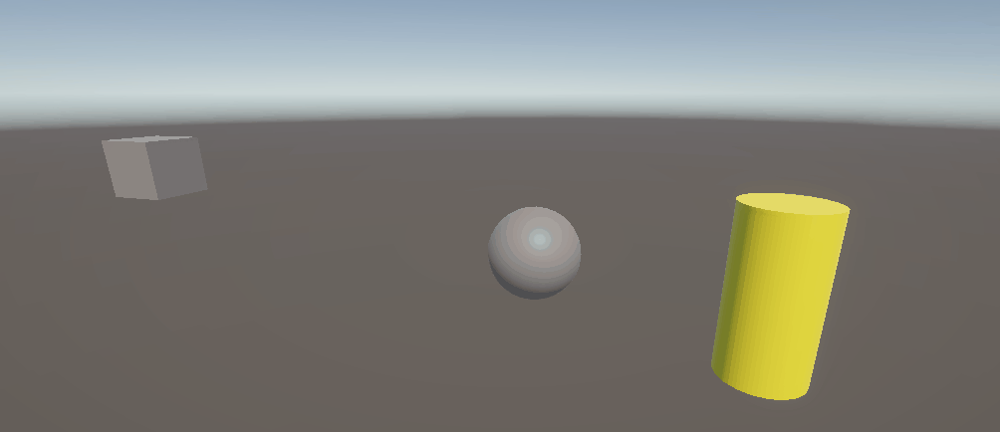

- **Exercise 11**:

The main purpose of this exercise is to make the cube automatically track and 
move towards the sphere's position at a constant speed, regardless of the 
distance separating them.

The script calculates the direction vector by subtracting the cube's position 
from the sphere's position (`sphereTransform.position - transform.position`). 
To ensure the cube maintains a fixed height and does not tilt or fly, the Y 
component of this vector is set to zero.

To prevent the movement speed from scaling with distance, the vector is 
normalized using `direction.normalized`, converting it into a unit vector of 
length 1. This normalized direction is multiplied by `speed` and 
`Time.deltaTime` to produce a uniform displacement vector. The translation is 
applied in world space (`Space.World`) to keep movement trajectory independent 
of the cube's local rotation.

As a result, whenever the sphere moves using WASD controls, the cube 
continuously chases it across the plane at a steady pace, as shown in the GIF 
below.

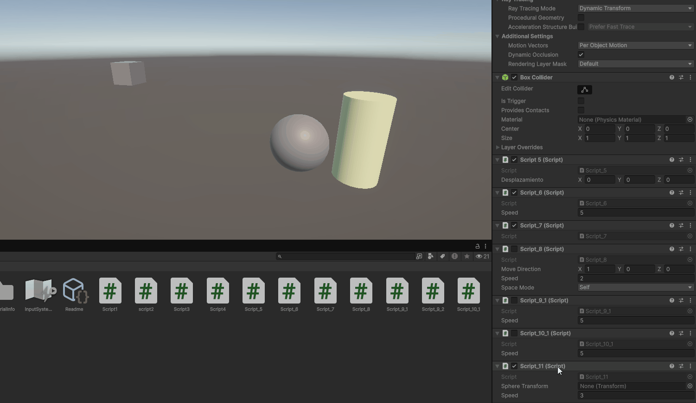

- **Exercise 12**:

The main purpose of this exercise is to orient the cube so that its positive 
Z axis continuously points toward the target sphere while moving forward in 
local space.

The `LookAndFollowSphere()` method uses `transform.LookAt(sphereTransform)` to 
rotate the cube toward the sphere every frame. Once oriented, the cube 
translates forward along its local Z axis using 
`Vector3.forward * speed * Time.deltaTime` in local space.

As a result, as the sphere moves, the cube dynamically adjusts its heading and 
pursues the sphere along its local forward direction, as shown in the GIF below.

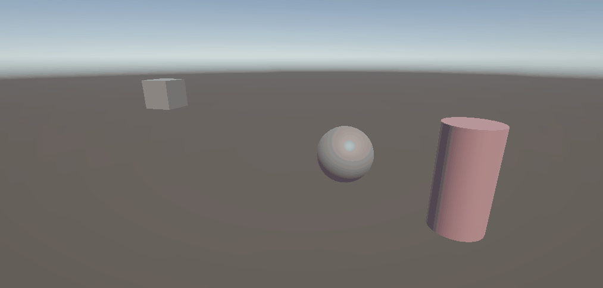

- **Exercise 13**:

The main purpose of this exercise is to implement vehicle style steering where 
the `Horizontal` axis controls angular rotation while the object continuously 
advances along its local forward direction.

In the `MoveAndTurn()` method, rotation around the Y axis is calculated by 
scaling `Input.GetAxis("Horizontal")` with `turnSpeed` and `Time.deltaTime`, 
and applied via `transform.Rotate()`. Simultaneously, the object moves forward 
at a constant speed along its local Z axis using `transform.Translate(0f, 0f, moveSpeed * Time.deltaTime)`.

Additionally, `Debug.DrawRay()` visualizes the object's `transform.forward` 
vector in the Scene view with a red ray extending 3 units out.

As a result, steering with the left/right arrow keys smoothly turns the object 
as it continuously travels forward, with the red ray indicating its facing 
direction, as shown in the GIF below.

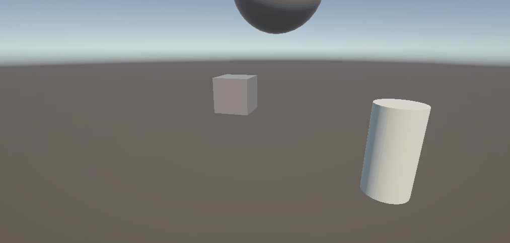

## Other information

This code was developed by 
* [Cristhian Adoney Cruz Delgado](https://github.com/CristhianCruzDelgado)

Contact emails 
* <alu0101648293@ull.edu.es>

This code was designed for Intelligent Interfaces, \
signature of the Computer Engineering degree, \
that is studied at the Univeridad de La Laguna.

_9 October 2026_